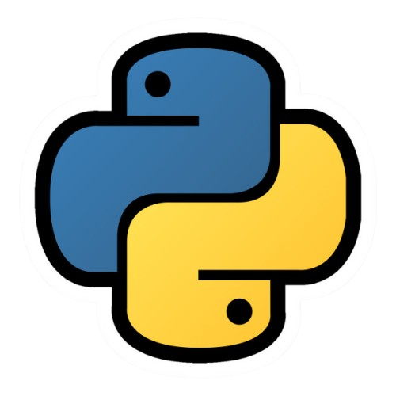

# MyWay - Python (2022/2023)

  

## ENGLISH

### Who am I?
Hey, I'm PoliCoding, I'm 17 (while writing this) and I live in Italy.  
I decided to publish all the exercise that i did in my first year of Computer  
Science as a reference for what i accomplished at the beginning of my journey. I see  
them as as a testament to my project, but also a way to look back at how I stared  
learning Python and reinforce my Solution-Orientated Mindset.

### Why should you see this?
Not only as a reference to my personal improvement only in a span of a year  
but also to see my "raw" code-style, code-logic and what I prefer. As you will  
see, i loved making game with PyGame, but also CLI application. Obviously  now  
I'm using engine like Godot, but is fun to see how i tried to create my first  
game making my own game-mechanic.

### I'm still at this level?
Obviously not. Right now, specifically with Python im developing ML model like   
OCR (Optical Character Recognition) + OSD (Orientation and Scripting Detection) and  
OHE (One Hot Encoding), mainly because i compete in the RoboCup JR. I will surely publish  
those model in the future (not the one that i use in the competition, obviously).

## DISCLAIMER
Most of the code written it's in my native language, so it may be difficult to understand. Also   
part of the code written may be "gibberish" or wont work, as I say, they're only a "test".

 
 
 

## ITALIANO

### Chi sono?
Ciao, Sono PoliCoding, Ho 17 Anni (mentre sto scrivendo questo) e abito in Italia.  
Ho deciso di pubblicare tutti i miei esercizi fatti il primo anno di informatica come  
referenza di ciò che ho fatto e ho raggiunto. Li pubblico principalmente per motivi  
personali, ma anche per vedere come ho iniziato python e come ho rafforzato le mie  
"Problem Solving" skill

### Perchè li pubblico?
Non solo, come detto precedentemente, per motivi personali, ma anche per vedere come sono  
migliorato in un anno, il mio primo. Per vedere anche il mio primo stile di scrittura, la  
mia logica al tempo e cosa preferivo fare. Quando ho iniziato infatti ero molto appassionato  
a fare giochi usando il framework PyGame, ma creai anche moltissime applicazioni CLI. Adesson  
ovviamente uso engine più "corposi" come Godot, ma è divertente vedere come creavo i miei primi  
giochi, e che logica usassi.

### Sono ancora a questo livello?
Certamente no. Adesso, con Python, sto sviluppando modelli ML come OCR (Optical Character Recognition) + 
OSD (Orientation and Scripting Detection) and OHE (One Hot Encoding), tutto ciò data la mia  
partecipazione alla RoboCup JR. Ovviamente, parte di questi modelli (quelli non usati in gara),  
pubblichero da qui a poco.

### DISCLAIMER
Gran parte del codice potrebbe non funzionare, oppure potrebbe essere fatto "a caso".  
Come ho detto prima, tutto ciò e solo un "test"
